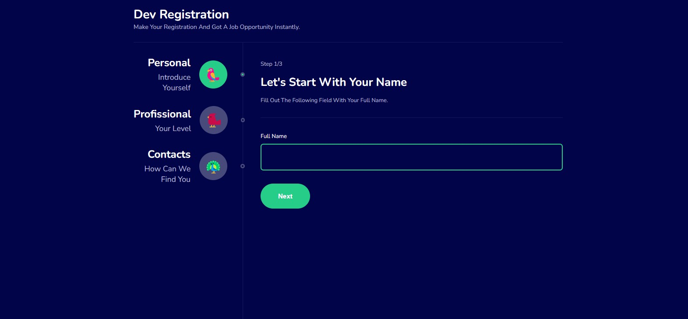
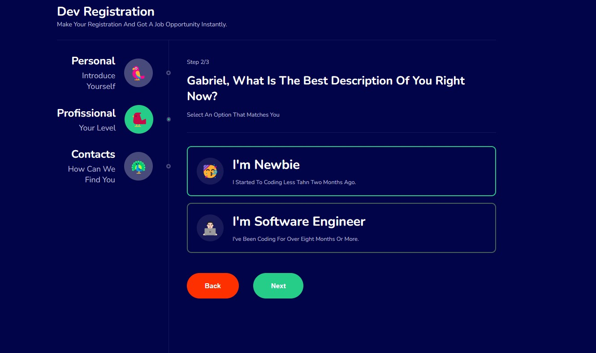
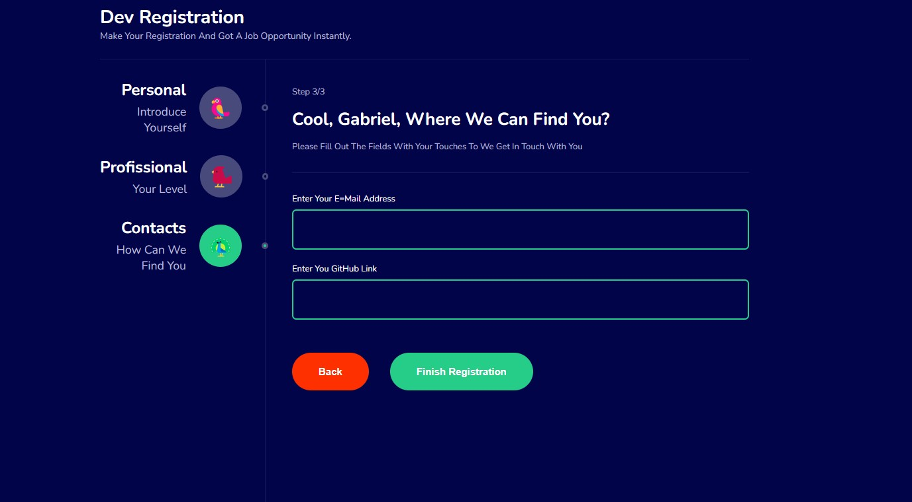

## Multiple Form Steps

## Technologies

<ul>
<li>REACT</li>
<li>TYPESCRIPT</li>
<li>STYLED-COMPONENTS</li>
<li>VITE (THIS PROJECT WAS BUILD UISING VITE)</li>
</ul>

## Libs

<ul>
<li>REACT-ROUTER-DOM</li>
<li>STYLED-COMPONENTS</li>
</ul>

## HOW IT'S LOOKS

    
     
    

    
     
    

    

## TO RUN INTO YOUR MACHINE:

``npm install (to install the packages)``  
``npm run dev (to run the app)``
